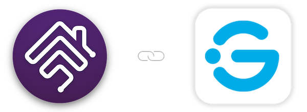

<p align="center">
   <a href="https://github.com/mp-consulting/homebridge-govee"></a>
</p>
<span align="center">

# homebridge-govee

Homebridge plugin to integrate Govee devices into HomeKit

</span>

> Originally based on [homebridge-govee](https://github.com/homebridge-plugins/homebridge-govee) by [Ben Potter](https://github.com/bwp91), licensed under the MIT License. This fork has been substantially rewritten by [MP Consulting](https://github.com/mp-consulting).

### Plugin Information

- This plugin allows you to view and control your Govee devices within HomeKit. The plugin:
  - requires your Govee credentials for most device models and Cloud/BLE connections
  - can control certain models locally via LAN control without any Govee credentials
  - does **not** make use of the Govee API key

### Prerequisites

- To use this plugin, you will need to already have:
  - [Node](https://nodejs.org): version `v20`, `v22` or `v24` - any other major version is not supported.
  - [Homebridge](https://homebridge.io): `v1.8` or above - refer to link for more information and installation instructions.
  - For bluetooth connectivity, it may be necessary to install extra packages on your system. Bluetooth works best when using a Raspberry Pi.

### Installation

Search for "Govee" in the Homebridge UI plugins tab, or install via npm:

```shell
npm install -g @mp-consulting/homebridge-govee
```

### Configuration

Configure the plugin using the Homebridge UI or by editing your `config.json`:

```json
{
  "platforms": [
    {
      "platform": "Govee",
      "name": "Govee",
      "username": "your-govee-email@example.com",
      "password": "your-govee-password"
    }
  ]
}
```

#### Configuration Options

| Option | Required | Description |
|--------|----------|-------------|
| `platform` | Yes | Must be `"Govee"` |
| `name` | Yes | Display name for the platform |
| `username` | Yes | Your Govee account email |
| `password` | Yes | Your Govee account password |
| `code` | No | One-time email verification code. Only needed the first time the plugin logs in, or when Govee flags a new device (see [New-device verification](#new-device-verification)). |
| `refreshTime` | No | Interval in seconds to refresh device states (default: 15) |
| `controlInterval` | No | Minimum interval in milliseconds between commands (default: 500) |
| `disableAWS` | No | Disable AWS IoT connection (default: false) |
| `disableLAN` | No | Disable LAN control (default: false) |
| `disableBLE` | No | Disable Bluetooth control (default: false) |

#### New-device verification

Govee protects accounts by challenging logins from a device it has not seen before with a one-time email code. The first time this plugin logs in (or if Govee later flags it as a new device), you may see a login failure noting that a **verification code has been emailed** to your Govee account address.

To complete the login:

1. Check your email for the code from Govee.
2. Paste it into the **Verification Code** field (config UI), or add `"code": "1234"` to your JSON config.
3. Save and restart Homebridge, or click **Test Connection** again in the config UI.

The plugin uses a stable client id derived from your account, so this is a one-time step — you can leave the code in place; it is ignored once login succeeds. If you only control devices over **Bluetooth or LAN**, this cloud login is optional and those devices keep working even if it is not completed.

### Features

#### Connection Methods

- **AWS IoT**: Real-time control via Govee cloud (requires credentials)
- **LAN**: Local network control (faster, no internet required for supported devices)
- **BLE**: Bluetooth control for nearby devices

#### Supported Device Types

- **Lights**: LED strips, bulbs, and other lighting devices
- **Switches**: Smart plugs and outlets
- **Sensors**: Temperature, humidity, leak detectors, presence sensors
- **Appliances**: Heaters, humidifiers, purifiers, fans, and more
- **Other**: Kettles, ice makers, and various smart home devices

### Development

```shell
npm run build        # Clean build (compile TS, copy certs, generate UI models)
npm run lint         # Lint with zero warnings
npm test             # Run unit tests (Vitest)
npm run test:watch   # Run tests in watch mode
npm run watch        # Build, link, and run with nodemon
```

### Architecture

The plugin uses a modular architecture:

- **Device Catalog** (`src/catalog/`): Centralized device definitions, command codes, and capabilities
- **Device Handlers** (`src/device/`): Individual handlers for each device type extending a common base class
- **Connections** (`src/connection/`): AWS IoT, LAN, and BLE connection managers

### Help/Support

- [Support Request](https://github.com/mp-consulting/homebridge-govee/issues/new/choose)
- [Changelog](CHANGELOG.md)

### Credits

- Based on the original [homebridge-govee](https://github.com/homebridge-plugins/homebridge-govee) plugin by [Ben Potter (bwp91)](https://github.com/bwp91), licensed under the MIT License
- To the creators/contributors of [Homebridge](https://homebridge.io) who make this plugin possible

### License

This project is licensed under the [MIT License](LICENSE). The original work is copyright (c) 2021-2024 Ben Potter (bwp91). Modifications and additions are copyright (c) 2025 Mickael Palma (MP Consulting). See the [LICENSE](LICENSE) file for full details.

### Disclaimer

- This plugin is a personal project maintained independently.
- Use this plugin entirely at your own risk - please see licence for more information.
