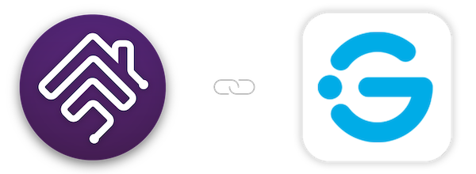

<p align="center">
   <a href="https://github.com/mp-consulting/homebridge-govee"></a>
</p>
<span align="center">

# homebridge-govee

Homebridge plugin to integrate Govee devices into HomeKit

</span>

> Originally based on [homebridge-govee](https://github.com/homebridge-plugins/homebridge-govee) by [Ben Potter](https://github.com/bwp91), licensed under the MIT License. This fork has been substantially rewritten by [MP Consulting](https://github.com/mp-consulting).

### Plugin Information

- This plugin allows you to view and control your Govee devices within HomeKit. The plugin:
  - requires your Govee credentials for most device models and Cloud/BLE connections
  - can control certain models locally via LAN control without any Govee credentials
  - does **not** make use of the Govee API key

### Prerequisites

- To use this plugin, you will need to already have:
  - [Node](https://nodejs.org): version `v20`, `v22` or `v24` - any other major version is not supported.
  - [Homebridge](https://homebridge.io): `v1.8` or above - refer to link for more information and installation instructions.
  - For bluetooth connectivity, it may be necessary to install extra packages on your system. Bluetooth works best when using a Raspberry Pi.

### Installation

Search for "Govee" in the Homebridge UI plugins tab, or install via npm:

```shell
npm install -g @mp-consulting/homebridge-govee
```

### Configuration

Configure the plugin using the Homebridge UI or by editing your `config.json`:

```json
{
  "platforms": [
    {
      "platform": "Govee",
      "name": "Govee",
      "username": "your-govee-email@example.com",
      "password": "your-govee-password"
    }
  ]
}
```

#### Configuration Options

| Option | Required | Description |
|--------|----------|-------------|
| `platform` | Yes | Must be `"Govee"` |
| `name` | Yes | Display name for the platform |
| `username` | Yes | Your Govee account email |
| `password` | Yes | Your Govee account password |
| `code` | No | One-time email verification code. Only needed the first time the plugin logs in, or when Govee flags a new device (see [New-device verification](#new-device-verification)). |
| `ignoreMatter` | No | Skip Matter-capable models, so they can be added to HomeKit natively instead (default: false) |
| `disableDeviceLogging` | No | Don't log device state changes (default: false) |
| `debug` | No | Verbose debug logging (default: false) |
| `httpRefreshTime` | No | Interval in seconds to poll the Govee HTTP API for sensor readings (thermo-hygrometers, leak sensors, air quality monitors) (default: 30, minimum: 30) |
| `awsDisable` | No | Disable the AWS IoT connection (default: false) |
| `bleDisable` | No | Disable Bluetooth (default: false) |
| `bleRefreshTime` | No | Interval in seconds between scans for Bluetooth thermo-hygrometer readings (default: 300, minimum: 60) |
| `bleControlInterval` | No | Minimum interval in milliseconds between Bluetooth commands (default: 500) |
| `lanDisable` | No | Disable LAN control (default: false) |
| `lanRefreshTime` | No | Interval in seconds to poll LAN devices for their state (default: 30) |
| `lanScanInterval` | No | Interval in seconds to scan the network for LAN devices (default: 60) |
| `colourSafeMode` | No | Use a slower but more reliable way of setting colours (default: false) |

Each device type also has its own list (`lightDevices`, `switchDevices`, `thermoDevices`, …) for per-device settings such as a label, `ignoreDevice`, and how the device appears in HomeKit (`showAs`). Smart plugs can be shown as a switch (the default), an outlet, an air purifier, heater, cooler, tap, valve or TV-type accessory; lights can be shown as a plain switch.

#### New-device verification

Govee protects accounts by challenging logins from a device it has not seen before with a one-time email code. The first time this plugin logs in (or if Govee later flags it as a new device), you may see a login failure noting that a **verification code has been emailed** to your Govee account address.

To complete the login:

1. Check your email for the code from Govee.
2. Paste it into the **Verification Code** field (config UI), or add `"code": "1234"` to your JSON config.
3. Save and restart Homebridge, or click **Test Connection** again in the config UI.

The plugin uses a stable client id derived from your account, so this is a one-time step — you can leave the code in place; it is ignored once login succeeds. If you only control devices over **Bluetooth or LAN**, this cloud login is optional and those devices keep working even if it is not completed.

### Features

#### Connection Methods

- **AWS IoT**: Real-time control via Govee cloud (requires credentials)
- **LAN**: Local network control (faster, no internet required for supported devices)
- **BLE**: Bluetooth control for nearby devices

#### Assistant (optional)

The config UI can explain problems and suggest settings with the **Assistant**. It is
off until you set up an AI provider once for all MP Consulting plugins in
[Homebridge AI Kit](https://github.com/mp-consulting/homebridge-ai-kit) (or the
Homebridge Glass UI): the plugin reads the shared `HomebridgeAiKit` platform block from
`config.json` and has no AI settings of its own. When it is not set up, the UI looks
exactly as before, with a small tip in the Settings tab.

When it is enabled:

- **Explain** buttons appear next to a failed **Test Connection**, a failed
  **Discover Devices**, a scene library that could not be loaded, and a failed
  **Clear Cache**. The answer streams into an Assistant panel below.
- **Describe Your Setup** (Settings tab) turns a request such as *"I only use Bluetooth
  sensors, no cloud"* into a change to the General and Connection settings, shown as a
  diff to apply or reject. Applied changes are kept after you click **Save Configuration**.

What is sent to the provider: the error message (email addresses, IP addresses and device
IDs masked), which connections are disabled, whether credentials and a verification code
are entered (yes/no only), `ignoreMatter`, the number of configured devices, and for a
device its label, model, device list and found-in-account / custom-IP-set / ignored flags.
Describe Your Setup sends only the General and Connection settings and their schema. Your
Govee email, password, verification code, tokens, device IDs, IP addresses and device
lists are never sent, and the provider's API key stays on the Homebridge server.

#### Device Discovery

The config UI can discover the devices on your Govee account and add them to the configuration automatically — no need to type device IDs by hand.

LAN discovery follows devices to a new IP address automatically. If Homebridge and your devices are on different VLANs, where multicast discovery can't reach them, set the device's **Custom IP Address** (`customIPAddress`) and give it a DHCP reservation. When your Govee account is configured, only devices in your account (or listed in the config) are added from LAN discovery.

#### Scenes

Open a light device in the config UI and go to its **Scene Library** tab. Your current selection sits at the top, and the Govee library is laid out below it as a grid showing the same names and icons as the Govee app, with the categories down the side. Each scene you choose becomes its own switch in HomeKit, so it can be used in automations and asked for by name.

- **Where the list comes from.** With your Govee credentials configured, the plugin fetches the scene library Govee publishes for that exact model, including your own **DIY effects**. Without credentials — or if Govee is unreachable — it falls back to a scene catalogue bundled with the plugin, so the picker still works for Bluetooth-only and LAN-only setups. The picker tells you which source it used.
- **Icons are cached locally.** Scene artwork is proxied and inlined by the plugin's UI server rather than loaded from Govee's CDN, and stored in your config alongside each scene so the list stays recognisable when you come back to it.
- **How many to add.** Every scene is a HomeKit service, and an accessory has a finite number of those. The picker warns past 50; if HomeKit refuses to add the accessory, trim the list.

Scenes are stored in the `scenes` array on each light device. The older fixed slots (`scene`, `sceneTwo`, `diyMode`, `musicMode`, `segmented`, `videoMode`, …) still work exactly as before, so existing configurations need no changes.

#### Music Mode

On a light device's **Music Mode** tab, turn on **Add a Music tile to HomeKit** to expose music mode as a separate HomeKit tile:

- **On/Off** switches the light into music mode.
- **Brightness** is the microphone sensitivity, adjustable live.
- **Colour** sets the music colour, when **Auto Colour** is turned off.

Choose the effect (Rhythm, Energic, Rolling, Spectrum) in the config. Older Govee lights use an earlier version of the music command — if the tile does nothing, switch **Protocol** to *Legacy* on the light's **Music Mode** tab.

> Scene, DIY and music support uses the same unofficial endpoints as the Govee app. They can change without notice, and the plugin falls back gracefully when they do.

#### Supported Device Types

- **Lights**: LED strips, bulbs, and other lighting devices
- **Switches**: Smart plugs and outlets
- **Sensors**: Temperature, humidity, air quality monitors, leak detectors, presence sensors
- **Appliances**: Heaters, humidifiers, purifiers, fans, and more
- **Other**: Kettles, ice makers, and various smart home devices

### Development

```shell
npm run build        # Clean build (compile TS, copy certs, generate UI models)
npm run lint         # Lint with zero warnings
npm run typecheck    # Type check the plugin and the tests
npm run knip         # Find unused files, exports and dependencies
npm test             # Run unit tests (Vitest)
npm run test:coverage # Run tests with coverage (thresholds enforced in CI)
npm run test:watch   # Run tests in watch mode
npm run watch        # Build, link, and run with nodemon
```

The build vendors `@mp-consulting/homebridge-ui-kit` and Bootstrap into
`homebridge-ui/public/lib/` with `mp-ui-kit-copy --vendor`. Until
`@mp-consulting/homebridge-ai-core` 2.0.0 and `@mp-consulting/homebridge-ui-kit` 1.2.0
are published, both are installed from sibling checkouts (`file:../homebridge-mcp-server/packages/ai-core`
and `file:../homebridge-ui-kit`); they must become `^2.0.0` and `^1.2.0` before release.

### Architecture

The plugin uses a modular architecture:

- **Device Catalog** (`src/catalog/`): Command codes for each device family; model lists live in `src/utils/constants.ts`
- **Device Handlers** (`src/device/`): Individual handlers for each device type extending a common base class
- **Connections** (`src/connection/`): AWS IoT, LAN, and BLE connection managers

### Help/Support

- [Support Request](https://github.com/mp-consulting/homebridge-govee/issues/new/choose)
- [Changelog](CHANGELOG.md)

### Credits

- Based on the original [homebridge-govee](https://github.com/homebridge-plugins/homebridge-govee) plugin by [Ben Potter (bwp91)](https://github.com/bwp91), licensed under the MIT License
- To the creators/contributors of [Homebridge](https://homebridge.io) who make this plugin possible

### License

This project is licensed under the [MIT License](LICENSE). The original work is copyright (c) 2021-2024 Ben Potter (bwp91). Modifications and additions are copyright (c) 2025 Mickael Palma (MP Consulting). See the [LICENSE](LICENSE) file for full details.

### Disclaimer

- This plugin is a personal project maintained independently.
- Use this plugin entirely at your own risk - please see licence for more information.
- Scene names, icon URLs and effect definitions come from the Govee Home app and remain the property of Govee. They are included only so this plugin can drive Govee hardware you already own.
